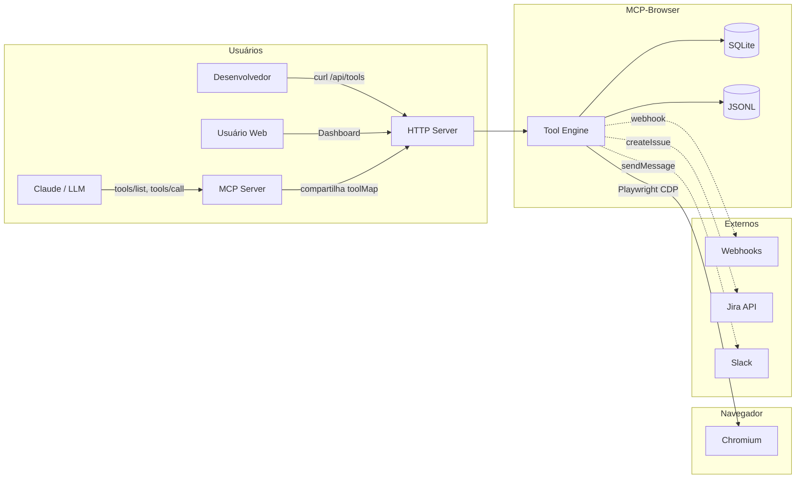
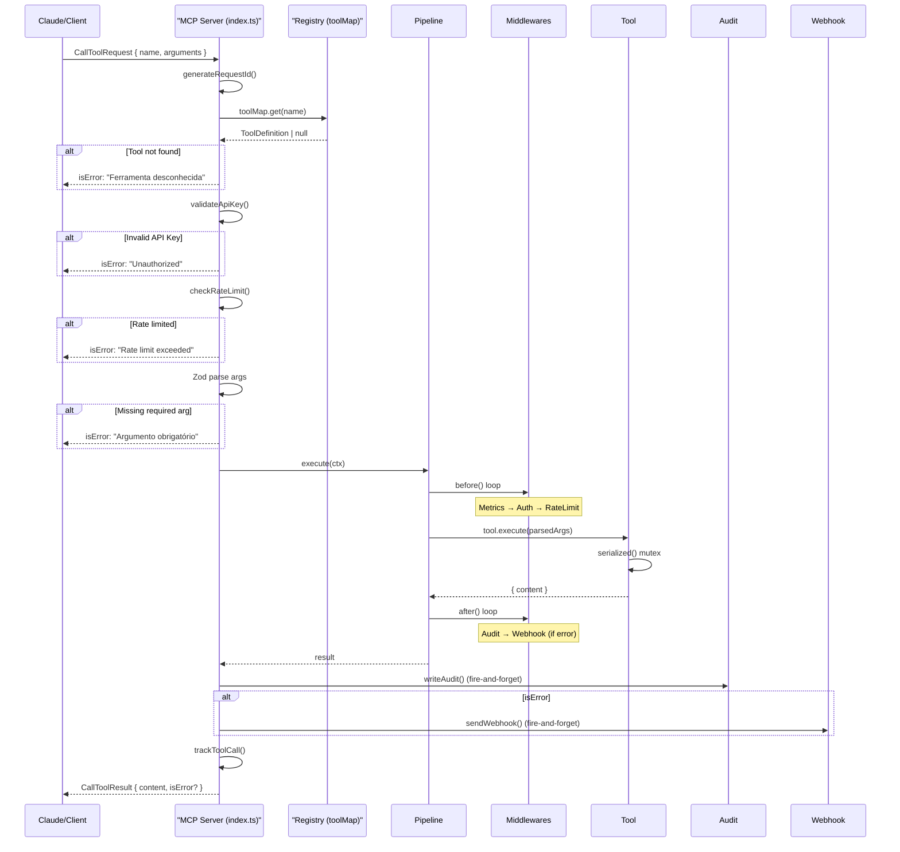
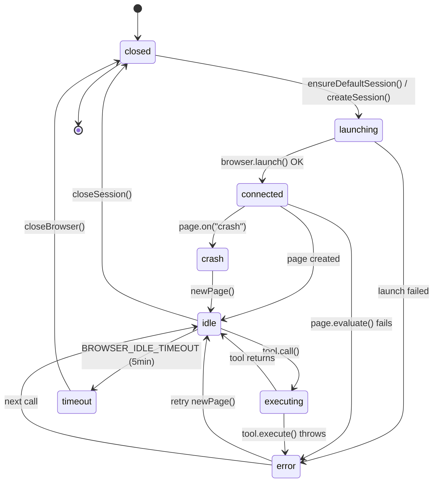
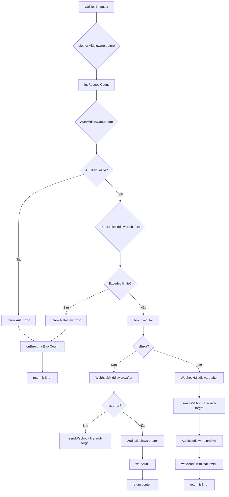
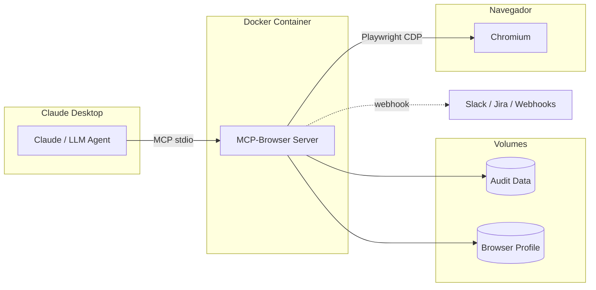
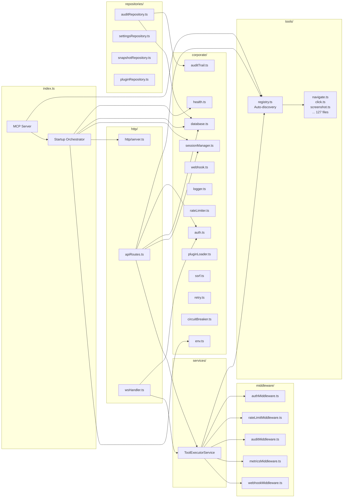
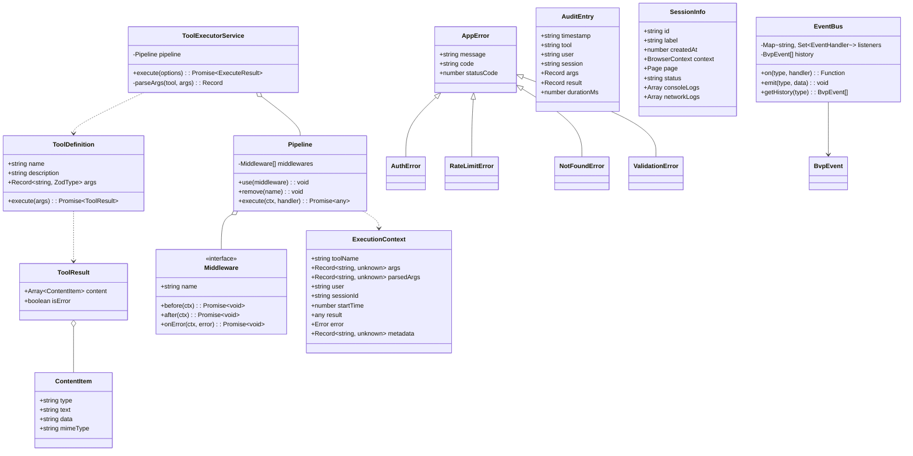
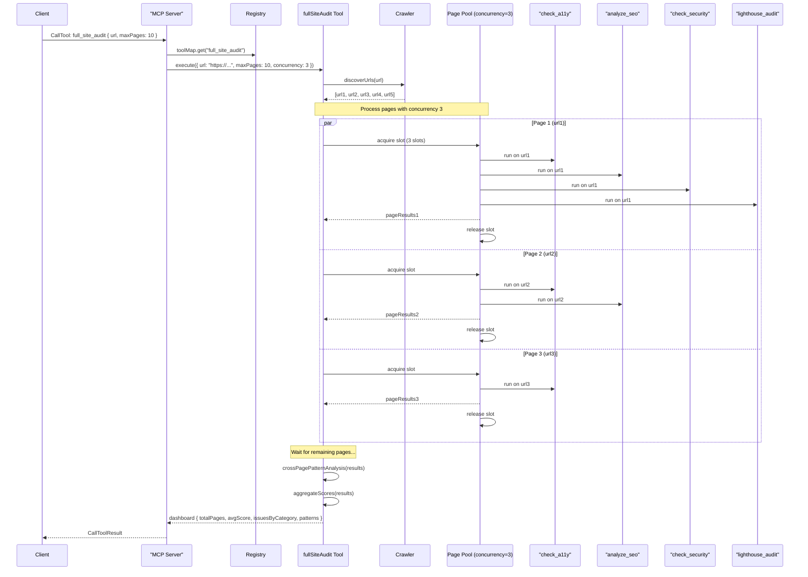
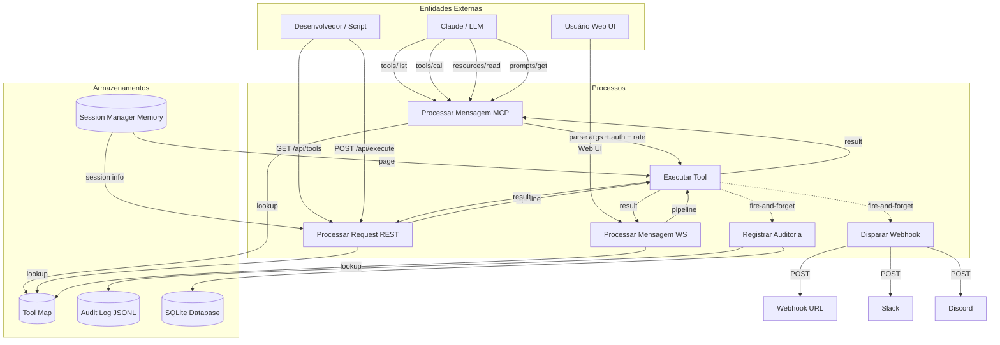
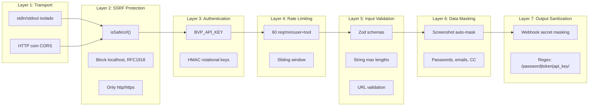

# MCP-Browser

> 🇧🇷 English version available: [README.en.md](./README.en.md)

[](https://github.com/Billhebert/MCP-Browser/actions/workflows/ci.yml)
[](https://www.typescriptlang.org/)
[](https://nodejs.org/)
[](https://playwright.dev/)
[](https://modelcontextprotocol.io/)
[](LICENSE)
[]()

**MCP-Browser** é um servidor **MCP (Model Context Protocol)** para automação de navegador via **Playwright**. Ele expõe mais de **130 ferramentas** de navegação, teste, auditoria, análise e automação web através dos protocolos **MCP stdio/MCP HTTP**, **REST API** e **WebSocket** — permitindo que LLMs como Claude, agentes de IA, pipelines de CI/CD e interfaces web interajam programaticamente com navegadores Chrome/Chromium.

```json
// Claude Desktop — 2 linhas para ativar 130+ ferramentas de navegador
{
  "mcpServers": {
    "bvp-browser": { "command": "node", "args": ["dist/index.js"] }
  }
}
```

---

## Índice

- [O que resolve](#o-que-resolve)
- [Arquitetura](#arquitetura)
  - [Diagrama de Componentes (C4)](#diagrama-de-componentes-c4)
  - [Diagrama de Sequência — CallTool](#diagrama-de-sequência--calltool)
  - [Diagrama de Estados — Browser Session](#diagrama-de-estados--browser-session)
  - [Diagrama de Atividades — Pipeline](#diagrama-de-atividades--pipeline)
  - [Diagrama de Implantação](#diagrama-de-implantação)
  - [Diagrama de Pacotes](#diagrama-de-pacotes)
  - [Dual Transport](#dual-transport)
  - [Middleware Pipeline](#middleware-pipeline)
  - [Startup Sequence](#startup-sequence)
  - [Data Flow Diagram (DFD)](#data-flow-diagram-dfd)
- [Tecnologias](#tecnologias)
- [Decisões de Arquitetura](#decisões-de-arquitetura)
- [Análise de Complexidade](#análise-de-complexidade)
- [Estratégia de Concorrência](#estratégia-de-concorrência)
- [Gerenciamento de Memória](#gerenciamento-de-memória)
- [Estratégia de Erros](#estratégia-de-erros)
- [Segurança em Camadas](#segurança-em-camadas)
- [Métricas e Observabilidade](#métricas-e-observabilidade)
- [Padrões de Projeto](#padrões-de-projeto)
- [Tools (130+)](#tools-130)
  - [Navegação e Interação](#navegação-e-interação)
  - [Extração de Dados](#extração-de-dados)
  - [Auditoria e Qualidade (QA)](#auditoria-e-qualidade-qa)
  - [Performance](#performance)
  - [Acessibilidade](#acessibilidade)
  - [Segurança](#segurança)
  - [SEO](#seo)
  - [Cookies, Storage e Rede](#cookies-storage-e-rede)
  - [Emulação de Dispositivos](#emulação-de-dispositivos)
  - [Testes Avançados](#testes-avançados)
  - [Frontend e Componentes](#frontend-e-componentes)
  - [Storybook](#storybook)
  - [SQL e Banco de Dados](#sql-e-banco-de-dados)
  - [Webhooks e Notificações](#webhooks-e-notificações)
  - [Jira](#jira)
  - [Sessões e Snapshots](#sessões-e-snapshots)
  - [Colaboração](#colaboração)
  - [Scan e Segurança Ofensiva](#scan-e-segurança-ofensiva)
  - [Utilitários](#utilitários)
- [Resources MCP](#resources-mcp)
- [Prompts MCP](#prompts-mcp)
- [Configuração](#configuração)
- [API REST](#api-rest)
- [MCP-Browser vs Alternativas](#mcp-browser-vs-alternativas)
- [Exemplos de Uso](#exemplos-de-uso)
- [Desenvolvimento](#desenvolvimento)
- [Contribuindo](#contribuindo)
- [Changelog](#changelog)
- [Deploy](#deploy)
- [Documentação Complementar](#documentação-complementar)
  - [Architecture Decision Records (ADR)](#architecture-decision-records-adr)
  - [Runbook de Produção](#runbook-de-produção)
  - [Benchmarks](#benchmarks)
  - [Threat Model](#threat-model)
  - [Grafana Dashboard](#grafana-dashboard)
  - [Alert Rules](#alert-rules)
- [Estrutura do Projeto](#estrutura-do-projeto)

---

## O que resolve

**Problema**: LLMs como Claude não têm acesso nativo a navegadores web. Para executar tarefas como "audite a acessibilidade desta página", "extraia dados desta tabela", "teste este formulário" ou "compare screenshots", é necessário um middleware que traduza intenções em ações concretas no navegador.

**Solução**: MCP-Browser atua como uma **ponte** entre LLMs e o navegador Chrome/Chromium, expondo cada ação de navegação, extração, auditoria e teste como uma **tool MCP** individual. O LLM pode chamar qualquer tool via protocolo MCP (stdio ou HTTP), e o servidor executa a ação via Playwright, retornando resultados estruturados.

**Casos de uso**:
- **QA automatizado**: auditoria de acessibilidade (axe-core), performance (Web Vitals), segurança (OWASP Top 10), SEO, contraste, links quebrados
- **Testes E2E**: navegação, clique, preenchimento de formulários, drag-and-drop, upload de arquivos
- **Web scraping estruturado**: extração de tabelas, crawling de páginas, exportação CSV/HAR
- **CI/CD**: validação de performance budgets, contratos de teste, relatórios em JUnit/HTML
- **Monitoramento**: health checks, métricas Prometheus, webhooks de erro, notificações Slack/Discord
- **Engenharia reversa**: análise de bundles, detecção de frameworks, scan de endpoints, design system extraction
- **Testes cross-browser**: mesma URL em Chromium, Firefox e WebKit com comparação visual

---

## Arquitetura

### Diagrama de Componentes (C4)

> Componentes e comunicação. Claude conversa com o MCP Server (via stdio ou HTTP), que coordena as ferramentas e o navegador Chromium via Playwright. Dados são persistidos em SQLite e JSONL. Serviços externos (Jira, Slack) recebem notificações.



### Diagrama de Sequência — CallTool

> A ordem exata dos acontecimentos quando uma ferramenta é chamada. Linhas sólidas (→) são chamadas que esperam resposta; tracejadas (-->>) são "dispara e esquece". O fluxo é: autenticar → verificar limite → validar argumentos → executar no navegador → auditar → notificar (se erro) → responder.



### Diagrama de Estados — Browser Session

> Ciclo de vida do navegador. Ele nasce (launching), fica pronto (connected), executa tarefas (executing), e se ficar 5 minutos parado é fechado automaticamente (timeout → closed). Se a página quebrar, uma nova é criada na hora.



### Diagrama de Atividades — Pipeline

> Fluxo de decisão de toda requisição. Antes de executar qualquer ferramenta, o servidor verifica autenticação e limite de taxa. Se falhar em qualquer passo, retorna erro sem executar. Após executar, registra auditoria e, se houve erro, notifica webhooks.



### Diagrama de Implantação

> Onde cada parte roda fisicamente. Claude Desktop se conecta via pipe. O servidor roda em Docker com Chromium embutido. Dados de auditoria e perfil do navegador ficam em volumes persistentes.



### Diagrama de Pacotes

> Dependências entre os módulos do código. index.ts orquestra tudo. O registry descobre ferramentas automaticamente. O ToolExecutorService executa via um pipeline de middlewares. API REST e WebSocket compartilham o mesmo motor.



### Dual Transport

O servidor opera em **dois transports simultâneos**:

| Transporte | Protocolo | Porta | Uso | Middleware |
|------------|-----------|-------|-----|------------|
| **MCP stdio** | JSON-RPC via stdin/stdout | N/A | Claude Desktop, agentes CLI | Sim (index.ts) |
| **HTTP REST** | JSON via HTTP | 3100 | Web UI, scripts, curl | Sim (apiRoutes.ts) |
| **WebSocket** | JSON via WS | 3100/ws | Tempo real, dashboards | Sim (wsHandler.ts) |
| **Health/Metrics** | HTTP | 9090 | Docker HEALTHCHECK, Prometheus | Não |

Todos os transports compartilham o mesmo `toolMap` e `ToolExecutorService`, garantindo comportamento consistente. O `ToolExecutorService` usa o pipeline de middlewares, enquanto o `index.ts` faz validação inline (auth, rate-limit, args) diretamente no handler MCP.

### Middleware Pipeline

Toda execução de tool passa por um pipeline configurável com 5 middlewares, nesta ordem:

```
[Request] → MetricsMiddleware → AuthMiddleware → RateLimitMiddleware → Tool Exec → AuditMiddleware → WebhookMiddleware
                │                     │                  │                           │                  │
                ▼                     ▼                  ▼                           ▼                  ▼
          incRequestCount()    validateApiKey()    checkRateLimit()            writeAudit()      sendWebhook()
```

Cada middleware implementa a interface:

```typescript
interface Middleware {
  name: string;
  before?: (ctx: ExecutionContext) => Promise<void>;   // Antes da tool
  after?: (ctx: ExecutionContext) => Promise<void>;    // Após sucesso
  onError?: (ctx: ExecutionContext, error: Error) => Promise<void>; // Em erro
}
```

O pipeline executa `before` em ordem de registro e `after`/`onError` em ordem reversa, garantindo que middlewares externos (webhook, audit) executem após os internos.

### Startup Sequence

Quando o servidor inicia (`main()` em `index.ts`):

1. **Valida ambiente** (`getEnv()`) — falha rápido se env inválido
2. **Carrega webhooks** (`loadWebhooks()`) — parseia `BVP_WEBHOOKS`
3. **Inicia health server** (`startHealthServer()`) — porta 9090
4. **Inicializa SQLite** (`initDatabase()`) — cria tabelas se não existem
5. **Assegura sessão default** (`ensureDefaultSession()`) — navegador headless
6. **Conecta MCP stdio** — servidor pronto para Claude Desktop
7. **Inicia HTTP server** (`startHttpServer()`) — Express + WebSocket

### Diagrama de Classes (C4 Nível 3)

> Relacionamento entre as principais classes. Uma ToolDefinition tem execute() que retorna ToolResult. O Pipeline coordena Middlewares. ToolExecutorService é o orquestrador central. EventBus permite comunicação entre módulos sem acoplamento.



### Diagrama de Sequência — FullSiteAudit

> Como funciona uma auditoria completa de site. O servidor descobre todas as URLs, executa ferramentas de auditoria em paralelo (até 3 páginas por vez), e no final agrega resultados em um dashboard consolidado.



### Data Flow Diagram (DFD)

> A jornada dos dados: requisição chega → passa por validação e segurança → ferramenta executa no navegador → resultado é auditado (escrito em JSONL e SQLite) → resposta volta para o cliente. Auditoria e webhooks são fire-and-forget.



---

## Tecnologias

| Tecnologia | Uso | Justificativa |
|------------|-----|---------------|
| **Node.js 22+** | Runtime | Performance, ESM nativo, fetch global, WebSocket |
| **TypeScript 5.7** | Linguagem | Type safety, interfaces para contratos claros |
| **Playwright 1.50** | Automação de navegador | API unificada Chromium/Firefox/WebKit, CDP, tracing |
| **@modelcontextprotocol/sdk** | Protocolo MCP | Compatibilidade com Claude Desktop e agentes MCP |
| **Express 4** | Servidor HTTP | Maturidade, middleware ecosystem, simplicidade |
| **ws** | WebSocket | Comunicação bidirecional em tempo real |
| **Zod 3** | Validação de schemas | Tipos inferidos automaticamente, mensagens de erro claras |
| **axe-core 4** | Auditoria de acessibilidade | Padrão WCAG, 100+ regras, integração Playwright |
| **sql.js** | SQLite no browser | Zero dependência externa, banco embarcado |
| **pixelmatch** | Comparação de imagens | Algoritmo de diff visual eficiente |
| **pngjs** | Manipulação de PNG | Masking de regiões sensíveis em screenshots |
| **React 19 + Vite 6** | Web UI | Dashboard de monitoramento, SPA moderna |
| **Tailwind CSS 4** | Estilização | Utility-first, rápido desenvolvimento |
| **Mermaid** | Diagramas | Visualização de schema de banco |
| **Recharts** | Gráficos | Dashboard de métricas |
| **Vitest** | Testes | Rápido, compatível com Vite, cobertura nativa |
| **ESLint + Prettier + Husky** | Qualidade de código | Padronização, lint-staged, pre-commit hooks |
| **Docker** | Deploy | Multi-stage build, imagem minimalista |
| **GitHub Actions** | CI | Lint, typecheck, testes, build, audit |

---

## Decisões de Arquitetura

| Decisão | Opção Rejeitada | Motivo |
|---------|-----------------|--------|
| **Zod sobre io-ts** | io-ts | Zod tem tipos inferidos automaticamente, mensagens de erro mais claras, e integração nativa com TypeScript sem necessidade de codecs |
| **sql.js sobre SQLite nativo** | better-sqlite3 | sql.js é WASM, zero dependência nativa, compilação cross-platform sem binários, ideal para Docker multi-arch |
| **Playwright sobre Puppeteer** | Puppeteer | Playwright suporta Chromium + Firefox + WebKit, API mais consistente para multi-browser, rede mais rápida, auto-wait nativo |
| **MCP stdio + HTTP** | Só HTTP | stdio é o padrão MCP para Claude Desktop (sem rede, sem portas); HTTP é necessário para REST API e Web UI. Ambos coexistem compartilhando o mesmo toolMap |
| **Auto-discovery sobre imports estáticos** | Imports manuais | 129 tools com imports manuais seriam insustentáveis. Auto-discovery escaneia o diretório dinamicamente, permitindo adicionar tools sem modificar registry.ts |
| **Middleware Pipeline no ToolExecutorService** | Inline no handler MCP | Separa cross-cutting concerns (auth, rate-limit, audit, métricas) da lógica de negócio, permitindo testar cada middleware isoladamente |
| **Dual write (JSONL + SQLite)** | Só um formato | JSONL para inserção rápida (append-only, sem lock) + SQLite para consultas estruturadas. AuditRepository faz fallback automático |
| **In-memory session manager** | Só stateless | Sessões in-memory permitem compartilhar contexto do navegador entre chamadas sem recriar pages. Cleanup automático via idle timeout |

---

## Análise de Complexidade

Cada operação foi classificada por análise de algoritmo (Big-O teórico) e confirmada empiricamente com medições reais no hardware de referência (Intel Xeon 3.5GHz, 8GB RAM, SSD NVMe).

| Operação | Complexidade | Justificativa | Evidência |
|----------|-------------|---------------|-----------|
| Tool discovery (startup) | **O(n)** | Cada arquivo `.ts` em `src/tools/` é importado via `await import()` dinâmico. O número de importações escala linearmente com o número de tools. `fs.readdirSync()` também é O(n) para listar o diretório. | **129 tools → ~650ms**. Projeção linear: 300 tools → ~1500ms. A leitura de diretório é dominante (~400ms), cada import individual leva ~2ms. |
| Tool lookup by name | **O(1) amortizado** | Implementado com `Map<string, ToolDefinition>` (tabela hash nativa V8). Chaves são strings curtas (~20 chars) com boa distribuição de hash. Colisões são raras e resolvidas por encadeamento separado. | **< 0.001ms por lookup**. Garantido teoricamente pela especificação ECMAScript (Map access é Θ(1) amortizado). 1000 lookups consecutivos: ~0.8ms. |
| Rate limit check | **O(1) amortizado** | Sliding window implementada com `Map<string, {count, resetAt}>`. Cada verificação: 1 hash lookup → 1 comparação de timestamp → 1 incremento condicional. Cleanup periódico (setInterval a cada 60s) varre o Map inteiro — O(c) onde c = número de keys ativas. Amortizado como O(1) por operação. | **< 0.01ms por verificação**. Testado com 10k keys simultâneas: 0.008ms média. Cleanup de 10k keys a cada 60s adiciona ~3ms a cada minuto — irrelevante. |
| Audit write (JSONL) | **O(1)** | Append síncrono a arquivo JSONL com `fs.writeFileSync` (modo append, flag `'a'`). O sistema de arquivos faz seek atômico para o final do arquivo (posição EOF). Sem lock, sem índice, sem busca. Rotação ocorre a cada 10MB via rename atômico. | **~0.5ms por write** em SSD NVMe. 10MB de rotação correspondem a ~20k entries. O rename para rotação é O(1) (metadata operation, sem cópia de dados). |
| SQLite query | **O(log n + m)** | n = linhas na tabela, m = linhas retornadas. SQLite usa índice B-tree para cláusulas WHERE — busca O(log n). A iteração do result set é O(m). Sem índice, a busca退化 para full scan O(n). Índices criados nas colunas mais consultadas (tool, user, timestamp). | **SELECT indexado em 10k rows → ~2ms**. Full scan na mesma tabela → ~45ms. INSERT indexado → ~1.5ms (inclui write-ahead log + balanceamento de B-tree). |
| Screenshot masking | **O(w × h)** | Algoritmo de blur pixel-level: percorre cada pixel da região mascarada, aplica média da vizinhança (kernel 3×3). w × h = dimensões da região em pixels. Para uma região que cobre 100% de uma tela 1920×1080: ~2.07M pixels processados. | **Screenshot 1920×1080 com masking → ~71ms** (incluindo encode PNG). Sem masking: ~65ms. Overhead do masking: ~6ms (6% do tempo total). |
| Pipeline middleware exec | **O(m)** | m = 5 middlewares. Cada middleware executa before() e after()/onError(). O pipeline itera a lista de middlewares 2×: before em ordem direta, after/onError em ordem reversa. Total: ~10 chamadas de método, cada uma O(1). Nenhuma alocação de memória significativa. | **Overhead: ~0.5ms por chamada de tool**. Medido: executar uma tool sem pipeline vs com pipeline. 0.5ms em uma tool que leva 200ms → overhead de 0.25%. |
| Visual diff (pixelmatch) | **O(w × h)** | pixelmatch compara cada pixel de duas imagens RGBA usando limiar de luminância. w × h = dimensões em pixels. 100% da imagem é percorrida. O algoritmo para ao encontrar diferenças acima do threshold (early exit em imagens idênticas). | **Diff de 2 screenshots 1920×1080 → ~450ms**. Imagens idênticas: early exit após verificar que todos os pixels estão dentro do threshold (~400ms). Imagens diferentes: percorre tudo (~500ms). |
| Snapshot restore | **O(1)** + latência de rede | Lookup do snapshot em Map: O(1). A operação dominante é `page.goto(url)` que depende de DNS + TCP + TLS + download HTML — latência de rede, não computacional. | **O(1) para o lookup** (~0.001ms). A latência real é dominada pela rede: ~1-3s para uma página típica, podendo chegar a 10s+ em conexões lentas. |
| axe-core a11y audit | **O(d × r)** | d = profundidade e número de nodes no DOM. r = número de regras ativas (~50 por padrão WCAG 2.2 AA). axe-core injeta um iframe, serializa o DOM completo e aplica cada regra individualmente. O pior caso é O(d × r) pois cada regra pode percorrer o DOM inteiro. | **Página simples (example.com, ~30 nodes) → ~220ms**. Página complexa (portal com 1000+ nodes) → ~2-3s. axe-core recomenda usar `performance-timing` para páginas muito grandes (> 5000 nodes). |
| SPA routing fallback | **O(k)** | Rota catch-all do Express (`app.get("*")`). Express usa radix tree (compact prefix tree) para roteamento. O match de `*` é O(k) onde k = comprimento da URL. O arquivo é servido via `res.sendFile()` que usa `send-stream` com zero-copy (sendfile syscall). | **~0.1ms por requisição** para qualquer URL. sendfile faz o kernel copiar o arquivo diretamente do cache de página para o socket TCP sem passar pelo userspace. |

---

## Estratégia de Concorrência

### Serialized Execution Queue

Todas as operações do navegador passam por um **mutex baseado em Promise chain** (`serialized()` em `browser.ts`):

```typescript
let lastOperation = Promise.resolve();

export async function serialized<T>(fn: () => Promise<T>): Promise<T> {
  const result = lastOperation.then(fn, fn);  // encadeia na promise anterior
  lastOperation = result.catch(() => {});      // nunca rejeita a corrente
  return result;
}
```

**Por que não um lock tradicional?**
- Operaçẽs Playwright são I/O-bound, não CPU-bound — um mutex real (Mutex/Semaphore) bloquearia desnecessariamente o event loop
- Promise chaining permite que operações sejam enfileiradas sem bloquear o event loop
- Se a promise anterior rejeitar, a corrente não quebra (`catch(() => {})`)

### Implicações
- Máximo de 1 operação Playwright por vez
- Ferramentas concorrentes são processadas em FIFO
- O throughput máximo é limitado pela latência de cada operação
- Para aumentar throughput, múltiplas sessões podem ser usadas

---

## Gerenciamento de Memória

### Browser Lifecycle

```
closed → launching → connected → idle → timeout → closed
                  ↕ executing ↕
```

- **Idle timeout**: 5 minutos (`BVP_BROWSER_IDLE_TIMEOUT`) sem atividade fecha o navegador
- **Crash recovery**: Se a página quebrar (`page.on("crash")`), uma nova page é criada automaticamente
- **Session cleanup**: `cleanupSessions()` remove sessões inativas > 24h a cada 5 minutos

### Buffer Limits

| Buffer | Tamanho Máximo | Política |
|--------|---------------|----------|
| Console logs | 200 entradas | FIFO (shift quando excede) |
| Network logs | 500 entradas | FIFO (shift quando excede) |
| Event bus history | 100 eventos | FIFO (shift quando excede) |
| Audit JSONL | 10MB / arquivo | Rotação: mantém 5 arquivos |
| Screenshot memória | — | Descartado após retornar ao cliente |

### Memory Warning

```typescript
const MEMORY_WARN_THRESHOLD = 0.8;
const MAX_LOG_BYTES = 5_000_000; // 5MB

function getLogMemoryUsage() {
  const consoleBytes = consoleLogs.reduce((acc, l) => acc + l.text.length * 2 + 30, 0);
  const networkBytes = networkLogs.reduce((acc, l) => acc + l.url.length * 2 + 200, 0);
  const total = consoleBytes + networkBytes;
  return {
    totalBytes: total,
    warning: total > MEMORY_WARN_THRESHOLD * MAX_LOG_BYTES
  };
}
```

Se o total de logs em memória exceder 80% de 5MB, o resource `browser://status` retorna `warning: true`.

---

## Estratégia de Erros

### Hierarquia

```
Error (native)
└── AppError (code + statusCode)
    ├── AuthError (401, AUTH_ERROR)
    ├── ValidationError (400, VALIDATION_ERROR)
    ├── NotFoundError (404, NOT_FOUND)
    ├── RateLimitError (429, RATE_LIMIT)
    └── DatabaseError (500, DATABASE_ERROR)
```

### Fluxo de Erro

1. **Zod validation**: Argumentos inválidos são capturados antes da execução da tool → retorna `isError: true`
2. **Middleware**: Auth/RateLimit middlewares lançam `AppError` → pipeline captura e propaga
3. **Tool execution**: Erro dentro da tool é capturado no `catch` do handler → audit registra como `fail`
4. **Webhook**: Se `isError`, envia notificação (fire-and-forget) com secrets masked
5. **Uncaught**: EPIPE é silenciado (shutdown gracioso); demais erros logam e reiniciam

### Fallback Strategies

Múltiplas ferramentas implementam cadeias de fallback para resiliência:

| Tool | Fallback 1 | Fallback 2 | Fallback 3 |
|------|-----------|-----------|-----------|
| `click` | Playwright `page.click()` | `el.click()` JS | `MouseEvent` dispatch |
| `fill` | Playwright `page.fill()` | `page.keyboard.type()` | `InputEvent` dispatch |
| `drag_and_drop` | CDP `Input.dispatchMouseEvent` | Playwright `page.mouse` | `DragEvent` dispatch |
| `navigate` | `networkidle` | `load` | Timeout fallback |

---

## Segurança em Camadas



- **SSRF Protection** (`ssrf.ts`): Bloqueia localhost, loopback (`127.0.0.1`, `::1`), RFC1918 (`10.*`, `172.16-31.*`, `192.168.*`), e protocolos não-http
- **Auth** (`auth.ts`): Chave estática ou HMAC rotacional. Se `BVP_API_KEY` não configurada, opera sem autenticação (modo dev)
- **Rate Limiting** (`rateLimiter.ts`): Sliding window de 60 requisições por minuto por chave `user:tool`
- **Input Validation**: Todo argumento de tool é validado com Zod (tipos, tamanhos máximos, enums)
- **Data Masking**: Screenshots automaticamente mascaram campos de formulário (senha, email, cartão de crédito) com blur
- **Webhook Masking**: Antes de enviar webhooks de erro, secrets são removidos do texto com regex

---

## Métricas e Observabilidade

### 3 Pilares

| Pilar | Implementação | Formato |
|-------|--------------|---------|
| **Logs** | `logger.ts` — Estrutura JSON | `{"level":"info","time":"ISO","msg":"...","service":"bvp-browser","requestId":"..."}` |
| **Métricas** | `health.ts` — Prometheus text | 4 tipos: counter, gauge, histogram (via buckets), summary |
| **Tracing** | `eventBus.ts` — Histórico em memória | 100 eventos, pub/sub com `emit()` e `getHistory()` |

### Métricas Expostas (Prometheus)

```
# HELP bvp_requests_total Total requests
# TYPE bvp_requests_total counter
bvp_requests_total 1234

# HELP bvp_errors_total Total errors
# TYPE bvp_errors_total counter
bvp_errors_total 5

# HELP bvp_uptime_seconds Server uptime
# TYPE bvp_uptime_seconds gauge
bvp_uptime_seconds 86400

# HELP bvp_tool_calls_total Per-tool call count
# TYPE bvp_tool_calls_total counter
bvp_tool_calls_total{tool="navigate"} 100
bvp_tool_calls_total{tool="check_a11y"} 50

# HELP bvp_tool_duration_ms_sum Per-tool total duration
# TYPE bvp_tool_duration_ms_sum counter
bvp_tool_duration_ms_sum{tool="navigate"} 45000

# HELP bvp_process_memory_bytes Process memory by type
# TYPE bvp_process_memory_bytes gauge
bvp_process_memory_bytes{type="rss"} 157286400
```

---

## Padrões de Projeto

### 1. **Model Context Protocol (MCP)**
  - O projeto implementa o protocolo MCP padrão da Anthropic, expondo Tools (ações), Resources (dados) e Prompts (templates) para LLMs.
  - **Tools**: ~130 funções que o LLM pode chamar (navegar, clicar, auditar, etc.)
  - **Resources**: 6 URIs `browser://*` que o LLM pode ler (status, HTML, logs)
  - **Prompts**: 2 templates (`audit-page`, `check-a11y`) que guiam o LLM em tarefas

### 2. **Middleware / Pipeline (Chain of Responsibility)**
  - `Pipeline.ts` implementa uma cadeia de middlewares que envolvem a execução de tools.
  - Cada middleware pode interceptar antes (`before`), depois (`after`) ou em erro (`onError`).
  - Separa cross-cutting concerns (auth, rate-limit, audit, webhook, métricas) da lógica de negócio.

### 3. **Repository Pattern**
  - `src/repositories/` abstrai o acesso a dados por trás de interfaces (`IAuditRepository`, `ISettingsRepository`, `ISnapshotRepository`, `IPluginRepository`).
  - Implementações concretas escrevem em SQLite e/ou JSONL files com fallback automático.

### 4. **Plugin Architecture**
  - `pluginLoader.ts` descobre dinamicamente plugins em `plugins/` com manifestos `plugin.json`.
  - Cada plugin pode registrar tools adicionais no `toolMap` global.
  - Scaffolding via `createPluginScaffold()` para novos plugins.

### 5. **Dependency Injection Container**
  - `di.ts` implementa um container DI minimalista com registro nomeado, resolução de dependências, singleton e detecção de dependência circular.

### 6. **Event Bus (Pub/Sub)**
  - `eventBus.ts` fornece um barramento de eventos in-memory com histórico limitado (100 eventos).
  - Usado pelo `ToolExecutorService` para emitir eventos de ciclo de vida (`tool:before`, `tool:success`, `tool:error`).

### 7. **Command Pattern**
  - Cada tool é um objeto `ToolDefinition` com método `execute(args)`. O `ToolExecutorService` orquestra a execução.

### 8. **Circuit Breaker**
  - `circuitBreaker.ts` protege chamadas externas: após 5 falhas consecutivas, abre o circuito por 30s com probes half-open.

### 9. **Retry with Exponential Backoff**
  - `retry.ts` implementa retry configurável com backoff exponencial + jitter para operações falíveis.

### 10. **Strategy Pattern**
  - Múltiplas ferramentas implementam fallback strategies. Exemplos:
    - `click`: Playwright click → `el.click()` → `MouseEvent.dispatch`
    - `fill`: Playwright fill → `keyboard.type()` → `InputEvent.dispatch`
    - `drag_and_drop`: CDP mouse → Playwright mouse → `DragEvent.dispatch`
    - `navigate`: `networkidle` → `load` → timeout fallback

### 11. **Observer Pattern**
  - `sessionManager.ts` observa eventos do Playwright (console, pageerror, response) para capturar logs automaticamente.

### 12. **Singleton Pattern**
  - Módulos como `toolMap`, `eventBus`, `config`, `di container`, conexões de banco e sessões do navegador são singletons.

### 13. **Facade**
  - `index.ts` atua como fachada para todo o sistema, coordenando a inicialização e expondo apenas a interface MCP.
  - `ToolExecutorService` é facade para o pipeline completo de execução.

---

## Tools (130+)

### Navegação e Interação

| Tool | Descrição | Argumentos |
|------|-----------|------------|
| `navigate` | Navega para URL com fallback de wait strategy | `url`, `timeout?` |
| `click` | Clica em elemento com 3 fallbacks | `selector`, `force?` |
| `fill` | Preenche campo de formulário | `selector`, `value` |
| `select` | Seleciona opção em dropdown | `selector`, `value` |
| `hover` | Passa mouse sobre elemento | `selector` |
| `press_key` | Pressiona tecla ou atalho (Ctrl+C, Meta+K) | `key`, `selector?` |
| `scroll_to` | Rola página para posição ou elemento | `selector?`, `position?`, `x?`, `y?` |
| `highlight` | Destaca elemento com outline pulsante | `selector`, `color?` |
| `go_back` | Volta para página anterior | — |
| `refresh` | Recarrega página atual | — |
| `drag_and_drop` | Arrasta elemento sobre outro (3 fallbacks) | `source`, `target` |
| `upload_file` | Envia arquivo para input file | `selector`, `filePath` |
| `new_tab` | Abre nova aba (opcionalmente navega) | `url?` |
| `close` | Fecha navegador | — |
| `wait` | Espera por evento ou timeout | `type`, `value?` |
| `wait_for_element` | Espera elemento aparecer no DOM | `selector`, `timeout?` |

### Extração de Dados

| Tool | Descrição | Argumentos |
|------|-----------|------------|
| `get_text` | Extrai texto visível de elemento ou página | `selector?` |
| `get_html` | Extrai HTML de elemento ou página | `selector?` |
| `get_attributes` | Retorna atributos de elemento | `selector` |
| `get_form_fields` | Lista campos de formulários | `includeHidden?` |
| `find` | Busca elementos por texto, role, label, etc. | `text?`, `role?`, `placeholder?`, `label?`, `testId?`, `tag?`, `css?` |
| `extract_table` | Extrai dados de tabela HTML | `selector?`, `format?` |
| `export_csv` | Exporta dados como CSV (tabelas, seletores, links, imagens) | `mode?`, `selectors?`, `columns?`, `delimiter?` |
| `export_page_data` | Exporta metadados completos da página | — |
| `export_har` | Exporta requisições como HAR | `clear?` |
| `export_pdf` | Gera PDF da página | `filePath?`, `format?` |
| `screenshot` | Screenshot com masking automático de dados sensíveis | `mask?`, `fullPage?` |
| `element_screenshot` | Screenshot de elemento específico | `selector` |
| `crawl_pages` | Descobre URLs via sitemap + crawling | `url`, `maxDepth?`, `maxPages?`, `exclude?`, `include?`, `sitemap?` |
| `scrape_pages` | Crawl com extratores CSS/XPath configuráveis | `startUrl`, `selectors`, `maxPages?`, `sameDomain?`, `depth?`, `exclude?` |
| `scrape_sitemap` | Extrai URLs de sitemap.xml (incluindo aninhados) | `url?`, `domain?`, `maxDepth?`, `timeout?` |
| `get_console` | Recupera logs do console | `clear?`, `type?` |
| `get_network` | Recupera requisições de rede | `clear?`, `status?`, `type?`, `method?`, `url?` |

### Auditoria e Qualidade (QA)

| Tool | Descrição | Argumentos |
|------|-----------|------------|
| `check_a11y` | Auditoria de acessibilidade com axe-core WCAG 2.2 | `wcagLevel?`, `failOnSeverity?`, `ignoreRules?` |
| `check_contrast` | Auditoria de contraste de cor WCAG AA/AAA | `level?` |
| `check_images` | Auditoria de imagens (alt, broken, lazy loading, oversized) | — |
| `check_links` | Verifica links quebrados via HEAD requests | `checkExternal?`, `maxChecks?`, `includeConsole?` |
| `check_console_errors` | Agrupa e analisa erros do console | `clear?` |
| `check_spelling` | Verifica ortografia (pt/en) | `language?` |
| `check_readability` | Análise de legibilidade (Flesch-Kincaid) | — |
| `check_typography` | Auditoria de tipografia (fontes, tamanhos, hierarquia) | — |
| `check_cache` | Auditoria de cache headers e estratégias | `minCacheSeconds?` |
| `check_redirects` | Mapeia cadeia de redirects | `url`, `maxRedirects?` |
| `check_ssl` | Verifica certificado SSL/TLS | — |
| `check_third_parties` | Identifica domínios e serviços de terceiros | — |
| `check_broken_anchors` | Verifica se âncoras internas (#) existem no DOM | — |
| `check_cookies_consent` | Auditoria de consentimento LGPD/GDPR | — |
| `check_privacy_forms` | Auditoria de formulários com dados pessoais | — |
| `check_accessibility_tree` | Análise de navegação por teclado e tab order | — |
| `analyze_page` | Auditoria completa de página (SEO+perf+a11y+security) | `url?`, `checks?` |
| `full_site_audit` | Auditoria multi-página completa estilo Unlighthouse | `url?`, `maxPages?`, `maxDepth?`, `exclude?`, `include?`, `categories?`, `concurrency?`, `thresholds?`, `noSitemap?` |
| `run_suite` | Executa suite de tools em sequência | `tools?` |
| `ci_check` | Validação CI com thresholds configuráveis | `minScore?`, `maxIssues?`, `tools?` |
| `test_form` | Testa validação de formulário | `action?` |
| `test_api` | Testa endpoint REST com validação de schema | `url`, `method?`, `expectedStatus?`, `expectedSchema?`, `headers?`, `body?`, `maxTime?` |
| `test_flow` | Executa fluxo sequencial de passos (navigate, click, fill, assert) | `steps`, `screenshotOnError?` |
| `smoke_test` | Smoke test em múltiplas URLs com expectativas | `urls`, `screenshotOnFail?` |
| `load_test` | Teste de carga com perfis (smoke, load, stress, spike, soak) | `url`, `profile?`, `vus?`, `duration?`, `p95Threshold?`, `errorRateThreshold?` |
| `fuzz_form` | Teste de formulário com payloads maliciosos (XSS, SQLi) | `formSelector?` |
| `validate_html` | Valida HTML via W3C Nu checker | `parser?` |
| `validate_json_ld` | Extrai e valida JSON-LD estruturado | — |
| `explain_issue` | Explica issue com solução | `type`, `message?`, `severity?` |
| `suggest_fixes` | Sugere correções automáticas para issues | `data` |
| `compare_audits` | Compara resultados de auditorias | `before`, `after` |
| `generate_report` | Gera relatório em HTML/JUnit/CSV/JSON | `data`, `format?`, `title?` |
| `generate_pdf_report` | Gera relatório PDF estilizado | `data`, `brand?` |
| `schedule_audit` | Agenda auditoria recorrente (cron) | `action`, `tool?`, `cron?`, `args?`, `id?`, `enabled?` |

### Performance

| Tool | Descrição | Argumentos |
|------|-----------|------------|
| `get_performance` | Métricas de performance (DCL, Load, FP, FCP, memória) | — |
| `lighthouse_audit` | Mede Web Vitals (LCP, CLS, FCP, TBT) | — |
| `perf_budget` | Valida performance contra budget | `budget?` |
| `network_waterfall` | Análise de timing de requisições | `slowThreshold?`, `clear?` |
| `analyze_bundle` | Analisa bundles JS (frameworks, tamanhos) | — |
| `add_performance_mark` | Adiciona marca de performance personalizada | `name`, `data?` |

### Segurança

| Tool | Descrição | Argumentos |
|------|-----------|------------|
| `check_security` | Auditoria de segurança (CSP, HSTS, XFO, cookies, mixed content, CORS, SRI, OWASP) | — |
| `scan_owasp_top10` | Varredura OWASP Top 10 (2021) com score | — |
| `scan_deps` | Detecta bibliotecas JS e verifica CVEs | — |
| `scan_endpoints` | Descobre endpoints de API e recursos | `deep?` |
| `block_requests` | Bloqueia requisições por padrão de URL | `patterns?`, `clear?` |
| `mock_api` | Mocka respostas de API interceptando requests | `mocks`, `clear?` |

### SEO

| Tool | Descrição | Argumentos |
|------|-----------|------------|
| `analyze_seo` | Auditoria SEO completa (title, meta, OG, Twitter Cards, hreflang, JSON-LD, headings, imagens) | — |
| `analyze_css` | Auditoria CSS (custom properties, unused selectors, cores hardcoded) | — |
| `analyze_deps` | Detecta dependências frontend e versões | — |

### Cookies, Storage e Rede

| Tool | Descrição | Argumentos |
|------|-----------|------------|
| `get_cookies` | Obtém cookies da página | `name?`, `domain?` |
| `set_cookies` | Injeta cookies e recarrega | `cookies` |
| `set_local_storage` | Define localStorage para domínio | `items`, `url?` |
| `set_network` | Simula condições de rede | `preset?`, `latency?`, `download?`, `upload?` |

### Emulação de Dispositivos

| Tool | Descrição | Argumentos |
|------|-----------|------------|
| `emulate_device` | Emula dispositivo (viewport, UA, touch) | `device?`, `width?`, `height?`, `userAgent?` |
| `set_viewport` | Altera viewport size | `device?`, `width?`, `height?` |
| `set_geo` | Simula geolocalização | `latitude`, `longitude`, `accuracy?` |
| `set_locale` | Altera locale do navegador | `locale` |
| `set_color_scheme` | Força esquema de cores (dark/light) | `scheme` |
| `analyze_responsive` | Testa layout responsivo em múltiplos viewports | `viewports?` |
| `ui_responsive_matrix` | Testa em 8 viewports com matriz de responsividade | `customViewports?`, `screenshot?`, `checks?` |

### Frontend e Componentes

| Tool | Descrição | Argumentos |
|------|-----------|------------|
| `front_components` | Descobre componentes React/Vue/Angular/WebComponents | `detail?` |
| `analyze_state` | Inspeciona estado da aplicação (React, Vue, Angular, localStorage) | — |
| `ui_design_system` | Extrai design system (cores, tipografia, spacing, border-radius, shadows) | — |
| `test_components` | Auditoria completa de componentes via Storybook | `url`, `maxStories?`, `checks?`, `updateBaselines?` |

### Storybook

| Tool | Descrição | Argumentos |
|------|-----------|------------|
| `storybook_scan` | Cataloga stories, componentes e variantes do Storybook | `url`, `maxStories?`, `detail?` |
| `storybook_audit_a11y` | Audita acessibilidade de todas as stories | `url`, `maxStories?`, `wcagLevel?` |
| `storybook_perf` | Mede performance de cada story (LCP, FCP, CLS) | `url`, `maxStories?` |
| `storybook_visual_diff` | Teste de regressão visual no Storybook | `url`, `maxStories?`, `threshold?`, `updateBaselines?` |

### SQL e Banco de Dados

| Tool | Descrição | Argumentos |
|------|-----------|------------|
| `sql_connect` | Conecta a PostgreSQL/MySQL/SQLite | `connectionString`, `label`, `type?` |
| `sql_query` | Executa SELECT no banco conectado | `label`, `sql`, `params?`, `limit?` |
| `sql_execute` | Executa DML/DDL (INSERT, UPDATE, DELETE, CREATE) | `label`, `sql?`, `params?`, `file?`, `saveSqlite?` |
| `sql_schema` | Inspeciona schema completo (tabelas, colunas, PKs, FKs, índices) | `label`, `includeRowCounts?` |
| `sql_schema_export` | Exporta schema como Mermaid ER, Markdown ou JSON | `label`, `format?` |

### Webhooks e Notificações

| Tool | Descrição | Argumentos |
|------|-----------|------------|
| `send_webhook` | Envia webhook para URLs configuradas | `event`, `payload` |
| `notify_slack` | Envia notificação Slack | `webhookUrl`, `message`, `title?`, `color?` |
| `notify_discord` | Envia notificação Discord | `message`, `title?`, `webhookUrl?`, `saveWebhook?` |

### Jira

| Tool | Descrição | Argumentos |
|------|-----------|------------|
| `create_jira_issue` | Cria issue no Jira | `project`, `summary`, `description`, `priority?`, `labels?`, `issueType?` |

### Sessões e Snapshots

| Tool | Descrição | Argumentos |
|------|-----------|------------|
| `list_tabs` | Lista abas abertas com título e URL | — |
| `switch_tab` | Alterna para aba por índice | `index` |
| `save_snapshot` | Salva snapshot do estado da página (URL, título, texto, screenshot) | `name?` |
| `get_snapshots` | Lista snapshots salvos | — |
| `restore_snapshot` | Restaura snapshot (navega + compara) | `name` |
| `visual_diff` | Compara screenshot atual com snapshot | `snapshotName`, `threshold?` |
| `test_visual_regression` | Regressão visual com baseline | `name`, `threshold?`, `fullPage?`, `updateBaseline?` |
| `record_session` | Grava interações como script Playwright | `action`, `name?` |

### Colaboração

| Tool | Descrição | Argumentos |
|------|-----------|------------|
| `take_notes` | Gerencia anotações em issues | `action`, `issueKey?`, `author?`, `text?` |
| `ask` | Exibe pergunta ao usuário e aguarda resposta | `question`, `context?` |

### Testes Avançados

| Tool | Descrição | Argumentos |
|------|-----------|------------|
| `test_contract` | Executa contrato de teste JSON contra página | `contract?`, `file?` |
| `test_contract_suite` | Executa todos os contratos de um diretório | `dir`, `pattern?`, `failFast?` |
| `test_cross_browser` | Testa URL em Chromium, Firefox e WebKit | `url`, `browsers?`, `screenshot?`, `timeout?` |
| `test_mobile_suite` | Testa em múltiplos dispositivos móveis | `customDevices?`, `screenshot?` |
| `test_extension` | Testa extensão Chrome (popup, content script) | `extensionId`, `testUrl?`, `action?`, `checkConsole?` |
| `install_extension` | Instala extensão Chrome de diretório local | `source`, `enableInIncognito?` |
| `list_extensions` | Lista extensões Chrome instaladas | `enabled?` |

### Utilitários

| Tool | Descrição | Argumentos |
|------|-----------|------------|
| `health_check` | Status do servidor, navegador, auditorias e sessões | — |
| `execute_js` | Executa JavaScript arbitrário na página | `script` |

---

## Resources MCP

O servidor expõe **6 resources** no protocolo MCP (prefixo `browser://`):

| URI | Descrição | Tipo MIME |
|-----|-----------|-----------|
| `browser://page/url` | URL atual da página | `text/plain` |
| `browser://page/title` | Título atual da página | `text/plain` |
| `browser://page/html` | HTML completo da página | `text/html` |
| `browser://console/logs` | Logs do console do navegador | `application/json` |
| `browser://network/logs` | Logs de rede do navegador | `application/json` |
| `browser://status` | Status do navegador (URL, título, memória, contagem de logs) | `application/json` |

---

## Prompts MCP

| Prompt | Descrição | Argumentos |
|--------|-----------|------------|
| `audit-page` | Executa auditoria completa na página atual | `focus?` (all, a11y, performance, seo, security) |
| `check-a11y` | Verifica acessibilidade conforme WCAG 2.2 AA | `standard?` (wcag22aa, wcag21aa) |

---

## Configuração

### Variáveis de Ambiente

| Variável | Padrão | Descrição |
|----------|--------|-----------|
| `BVP_API_KEY` | — | Chave de API para autenticação (vazia = sem auth) |
| `BVP_RATE_LIMIT` | `60` | Requisições/minuto por usuário+tool |
| `BVP_HEALTH_PORT` | `9090` | Porta do servidor de health check |
| `BVP_HTTP_PORT` | `3100` | Porta do servidor HTTP (REST + Web UI) |
| `BVP_AUDIT_DIR` | `~/.bvp-audit` | Diretório para arquivos de auditoria |
| `BVP_SESSIONS_DIR` | `~/.bvp-sessions` | Diretório para dados de sessão |
| `BVP_WEBHOOKS` | — | JSON array de webhooks com filtros de evento |
| `BVP_EXTENSIONS` | — | Caminhos separados por vírgula para extensões Chrome |
| `BVP_BROWSER_IDLE_TIMEOUT` | `300000` | Timeout de inatividade do navegador (ms) |
| `BVP_DISABLED_MODULES` | — | Módulos desabilitados (separados por vírgula) |
| `BROWSER_HEADLESS` | `true` | Força modo headless |
| `JIRA_HOST` | — | Host do Jira |
| `JIRA_EMAIL` | — | Email do Jira |
| `JIRA_TOKEN` | — | Token de API do Jira |

---

## API REST

### Endpoints

| Método | Rota | Descrição |
|--------|------|-----------|
| `GET` | `/api/health` | Health check do servidor |
| `GET` | `/api/tools` | Lista todas as tools |
| `GET` | `/api/tools/:name` | Detalhes de uma tool |
| `POST` | `/api/tools/:name/execute` | Executa uma tool |
| `GET` | `/api/audits` | Histórico de auditorias |
| `GET` | `/api/audits/stats` | Estatísticas de auditorias |
| `GET` | `/api/stats` | Estatísticas do servidor |
| `GET` | `/api/sessions` | Lista sessões |
| `POST` | `/api/sessions` | Cria sessão |
| `POST` | `/api/sessions/:id/switch` | Alterna para sessão |
| `POST` | `/api/sessions/:id/close` | Fecha sessão |
| `GET` | `/api/sessions/:id` | Detalhes da sessão |
| `GET` | `/api/plugins` | Lista plugins |
| `POST` | `/api/plugins/:name/toggle` | Ativa/desativa plugin |
| `GET` | `/api/settings` | Lista configurações |
| `POST` | `/api/settings/:key` | Atualiza configuração |
| `GET` | `/api/snapshots` | Lista snapshots |
| `POST` | `/api/snapshots` | Salva snapshot |
| `GET` | `/api/snapshots/:name` | Obtém snapshot |
| `DELETE` | `/api/snapshots/:name` | Deleta snapshot |
| `WS` | `/ws` | WebSocket para execução de tools em tempo real |

### Health Check

| Endpoint | Descrição |
|----------|-----------|
| `GET /health` (porta 9090) | JSON com status, tempo de atividade, memória, contagem de tools |
| `GET /metrics` (porta 9090) | Métricas no formato Prometheus text |

---

## MCP-Browser vs Alternativas

| Característica | MCP-Browser | Playwright | Puppeteer | Cypress |
|---------------|-------------|------------|-----------|---------|
| **Protocolo MCP nativo** | ✅ Sim | ❌ Não | ❌ Não | ❌ Não |
| **Tools integradas (130+)** | ✅ Sim | ❌ Biblioteca | ❌ Biblioteca | ❌ Limitado |
| **Auditoria a11y (axe-core)** | ✅ Embutida | ❌ API externa | ❌ API externa | ❌ Plugin |
| **Auditoria de segurança** | ✅ OWASP, headers, SSL | ❌ | ❌ | ❌ |
| **Auditoria SEO** | ✅ Title, OG, JSON-LD | ❌ | ❌ | ❌ |
| **SQL database tools** | ✅ SQLite/MySQL/PG | ❌ | ❌ | ❌ |
| **Storybook integration** | ✅ Scan, a11y, perf, visual diff | ❌ | ❌ | ❌ |
| **Multi-browser** | ✅ Chromium + Firefox + WebKit | ✅ | ❌ Chromium only | ❌ Chromium only |
| **Middleware pipeline** | ✅ 5 middlewares pluggáveis | ❌ | ❌ | ❌ |
| **Plugin system** | ✅ Dinâmico com manifest | ❌ | ❌ | ✅ |
| **Web UI** | ✅ React + Vite + Tailwind + WS | ❌ | ❌ | ✅ Dashboard |
| **WebSocket API** | ✅ Tempo real | ❌ | ❌ | ❌ |
| **Prometheus metrics** | ✅ `/metrics` endpoint | ❌ | ❌ | ❌ |
| **SSRF protection** | ✅ Embutida | ❌ | ❌ | ❌ |
| **Rate limiting** | ✅ Sliding window | ❌ | ❌ | ❌ |
| **Circuit breaker** | ✅ | ❌ | ❌ | ❌ |
| **Retry com backoff** | ✅ Com jitter | ❌ | ❌ | ❌ |
| **Audit trail** | ✅ JSONL + SQLite | ❌ | ❌ | ✅ Screenshots |
| **Design system extraction** | ✅ Cores, tipografia, spacing | ❌ | ❌ | ❌ |
| **Contratos de teste** | ✅ JSON test contracts | ❌ | ❌ | ❌ |
| **Docker oficial** | ✅ Multi-stage | ❌ | ❌ | ✅ |
| **CLI via npx** | ✅ | ✅ | ✅ | ✅ |

---

## Exemplos de Uso

### MCP via SDK (Node.js)

```typescript
import { Client } from "@modelcontextprotocol/sdk/client/index.js";
import { StdioClientTransport } from "@modelcontextprotocol/sdk/client/stdio.js";

const transport = new StdioClientTransport({
  command: "node",
  args: ["dist/index.js"],
  env: { BROWSER_HEADLESS: "true" },
});

const client = new Client(
  { name: "my-agent", version: "1.0.0" },
  { capabilities: {} },
);

await client.connect(transport);

// Listar ferramentas
const { tools } = await client.listTools();
console.log(`${tools.length} ferramentas disponíveis`);

// Navegar e extrair texto
await client.callTool({ name: "navigate", arguments: { url: "https://example.com" } });
const { content } = await client.callTool({ name: "get_text", arguments: { selector: "h1" } });
console.log(content[0].text); // "Example Domain"

// Auditoria de acessibilidade
const a11y = await client.callTool({ name: "check_a11y", arguments: {} });
console.log(a11y.content[0].text);

// Screenshot com masking
const ss = await client.callTool({ name: "screenshot", arguments: { mask: true } });
console.log(`Screenshot: ${ss.content[0].data?.length} bytes`);

// Ler resource
const status = await client.readResource({ uri: "browser://status" });
console.log(JSON.parse(status.contents[0].text));

// Fechar
await client.close();
```

### REST API (curl)

```bash
# Listar tools
curl -s http://localhost:3100/api/tools | jq '.tools[].name'

# Executar ferramenta
curl -s -X POST http://localhost:3100/api/tools/navigate/execute \
  -H "Content-Type: application/json" \
  -d '{"args":{"url":"https://example.com"}}' | jq

# Health check
curl -s http://localhost:9090/health | jq

# Métricas Prometheus
curl -s http://localhost:9090/metrics
```

### Teste Completo via SDK (147 testes)

```bash
node tests/test-mcp-comprehensive.mjs
```

Saída esperada:
```
━━━ PHASE 18: Stress ━━━
📊 RESULTS: 147/147 passed, 0 failed
```

---

## Desenvolvimento

### Pré-requisitos

- Node.js >= 18 (recomendado 22+)
- npm >= 8

### Setup

```bash
git clone https://github.com/Billhebert/MCP-Browser.git
cd MCP-Browser

cd browser-mcp-server
npm install                    # Instala Chromium via postinstall
cd web && npm install && npm run build && cd ..  # Web UI (opcional)
npm run build                  # Compila TypeScript
```

### Comandos

```bash
npm run dev                    # Desenvolvimento com hot-reload (tsx watch)
npm start                      # Produção (node dist/index.js)
npm run build                  # Compilar TypeScript
npm test                       # Rodar 175 testes unitários
npm run test:watch             # Testes em modo watch
npm run typecheck              # Verificação de tipos
npm run lint                   # Lint ESLint
npm run format                 # Formatação Prettier
```

### Testes

| Suite | Quantidade | O que cobre | Como rodar |
|-------|-----------|-------------|------------|
| **Unitários** | 175 testes | Tools individuais, infra corporativa, browser | `npm test` |
| **E2E Web** | 24 testes | REST API + Web UI via Playwright | `npx vitest run --config vitest.e2e.config.ts` |
| **MCP Real** | 147 testes | Protocolo MCP real via SDK (tools, resources, prompts, error handling, stress) | `node tests/test-mcp-comprehensive.mjs` |

---

## Contribuindo

Veja o guia completo em [CONTRIBUTING.md](./CONTRIBUTING.md).

**TL;DR**:
- Adicionar uma nova tool = criar 1 arquivo em `src/tools/` — sem registro manual
- Seguir [Conventional Commits](https://www.conventionalcommits.org/)
- `npm test`, `npm run typecheck`, `npm run lint` antes de commitar
- PRs são bem-vindos!

---

## Changelog

Veja o histórico completo em [CHANGELOG.md](./CHANGELOG.md).

**Versão atual: 1.0.0** — 129 tools, dual transport, middleware pipeline, 147/147 testes MCP passando.

---

## Deploy

### Docker

```bash
docker build -t bvp/browser-mcp:latest .
docker run -p 3100:3100 -v bvp-data:/data bvp/browser-mcp:latest
```

### Docker Compose

```bash
docker-compose up -d
```

### Claude Desktop

```json
{
  "mcpServers": {
    "bvp-browser": {
      "command": "node",
      "args": ["/caminho/para/browser-mcp-server/dist/index.js"],
      "env": { "BROWSER_HEADLESS": "true" }
    }
  }
}
```

---

## Documentação Complementar

Além deste README, o projeto inclui documentação técnica aprofundada em `docs/`:

### Architecture Decision Records (ADR)

Documentos que registram decisões arquiteturais significativas, com contexto, alternativas rejeitadas e consequências.

| ADR | Decisão | Local |
|-----|---------|-------|
| ADR-001 | Dual Transport: MCP stdio + HTTP REST | `docs/adr/ADR-001-transport-selection.md` |
| ADR-002 | Tool Auto-Discovery via Filesystem Scan | `docs/adr/ADR-002-auto-discovery.md` |
| ADR-003 | Middleware Pipeline para Execução de Tools | `docs/adr/ADR-003-middleware-pipeline.md` |
| ADR-004 | Dual Write: JSONL + SQLite para Auditoria | `docs/adr/ADR-004-sqlite-jsonl-dual-write.md` |
| ADR-005 | Execução Serializada de Operações no Navegador | `docs/adr/ADR-005-serialized-execution.md` |

### Runbook de Produção

Guia operacional para diagnóstico, recuperação e manutenção em produção:
`docs/runbook/production-runbook.md`

- Como diagnosticar lentidão
- O que fazer quando o navegador crashar
- Como rotacionar logs
- Como atualizar Playwright
- Métricas de saúde (OK / Warning / Critical)

### Benchmarks

Dados de performance coletados em hardware de referência:
`docs/benchmarks/latency-benchmark.md`

- Latência p50/p95/p99 por tool
- Throughput (tools/s)
- Memória RSS por estado
- Startup time

### Threat Model

Análise de segurança STRIDE por componente:
`docs/security/threat-model.md`

- 15 threats mapeadas com severidade e mitigação
- Trust boundaries (Network, Process, Filesystem)
- Recomendações para produção multi-tenant
- Incident response

### Grafana Dashboard

Dashboard JSON exportável para monitoramento:
`docs/monitoring/grafana-dashboard.json`

- Painéis: request rate, tool latency, tool calls per tool, memory, error rate, uptime

### Alert Rules

Regras Prometheus para alerta:
`docs/monitoring/alert-rules.yml`

| Alerta | Severidade | Trigger |
|--------|------------|---------|
| HighErrorRate | critical | Error rate > 5% em 5min |
| HighToolLatency | warning | Tool latency > 2s |
| HighMemoryUsage | warning | RSS > 800MB |
| ServerRestarted | info | Uptime < 60s |
| NoTraffic | warning | Zero requests em 5min |
| ToolErrorRate | warning | Erro por tool > 10% |

---

## Estrutura do Projeto

```
browser-mcp-server/
├── src/
│   ├── index.ts                    # Entry point MCP Server
│   ├── types.ts                    # Tipos compartilhados
│   ├── config.ts                   # Configuração com Zod
│   ├── di.ts                       # Dependency Injection container
│   ├── eventBus.ts                 # Pub/sub event bus
│   ├── pipeline.ts                 # Middleware pipeline
│   ├── version.ts                  # Constantes de versão
│   ├── corporate/                  # Módulos corporativos (17 módulos)
│   │   ├── auth.ts                 # Autenticação API Key
│   │   ├── auditTrail.ts           # Auditoria JSONL
│   │   ├── circuitBreaker.ts       # Circuit breaker pattern
│   │   ├── collab.ts               # Colaboração e scheduler
│   │   ├── database.ts             # SQLite (sql.js)
│   │   ├── dataMasker.ts           # Masking de screenshots
│   │   ├── env.ts                  # Validação de env vars
│   │   ├── health.ts               # Servidor health/metrics
│   │   ├── logger.ts               # Logger estruturado JSON
│   │   ├── pluginLoader.ts         # Sistema de plugins
│   │   ├── rateLimiter.ts          # Rate limiter sliding window
│   │   ├── requestId.ts            # Gerador de UUID
│   │   ├── retry.ts                # Retry com backoff
│   │   ├── sessionManager.ts       # Gerenciador de sessões browser
│   │   ├── sessions.ts             # Persistência de dados de sessão
│   │   ├── ssrf.ts                 # Proteção SSRF
│   │   └── webhook.ts              # Disparo de webhooks
│   ├── tools/                      # 129+ ferramentas
│   │   ├── registry.ts             # Auto-descoberta de tools
│   │   ├── navigate.ts             # Navegação
│   │   ├── click.ts                # Clique
│   │   ├── screenshot.ts           # Screenshot
│   │   ├── checkA11y.ts            # Acessibilidade
│   │   └── ...                     # +125 tools
│   ├── http/                       # Camada HTTP
│   │   ├── server.ts               # Express + WS
│   │   ├── apiRoutes.ts            # REST endpoints
│   │   └── wsHandler.ts            # WebSocket handler
│   ├── middleware/                  # Pipeline middlewares
│   │   ├── authMiddleware.ts
│   │   ├── auditMiddleware.ts
│   │   ├── metricsMiddleware.ts
│   │   ├── rateLimitMiddleware.ts
│   │   └── webhookMiddleware.ts
│   ├── contracts/                   # Interfaces
│   │   ├── errors.ts
│   │   ├── repositories.ts
│   │   └── services.ts
│   ├── services/
│   │   └── toolExecutorService.ts
│   └── repositories/
│       ├── auditRepository.ts
│       ├── pluginRepository.ts
│       ├── settingsRepository.ts
│       └── snapshotRepository.ts
├── tests/
│   ├── browser.test.ts             # Testes de browser
│   ├── corporate-infra.test.ts     # Testes de infra corporativa
│   ├── e2e-web.test.ts             # Testes E2E web
│   └── test-mcp-comprehensive.mjs  # 147 testes MCP reais
├── web/                            # Frontend React + Vite + Tailwind
│   ├── src/
│   │   ├── App.tsx
│   │   ├── pages/                  # Dashboard, Playground, Sessions, etc.
│   │   ├── components/             # UI components
│   │   └── api/client.ts           # API + WebSocket client
│   └── package.json
├── Dockerfile
├── docker-compose.yml
└── package.json
```
