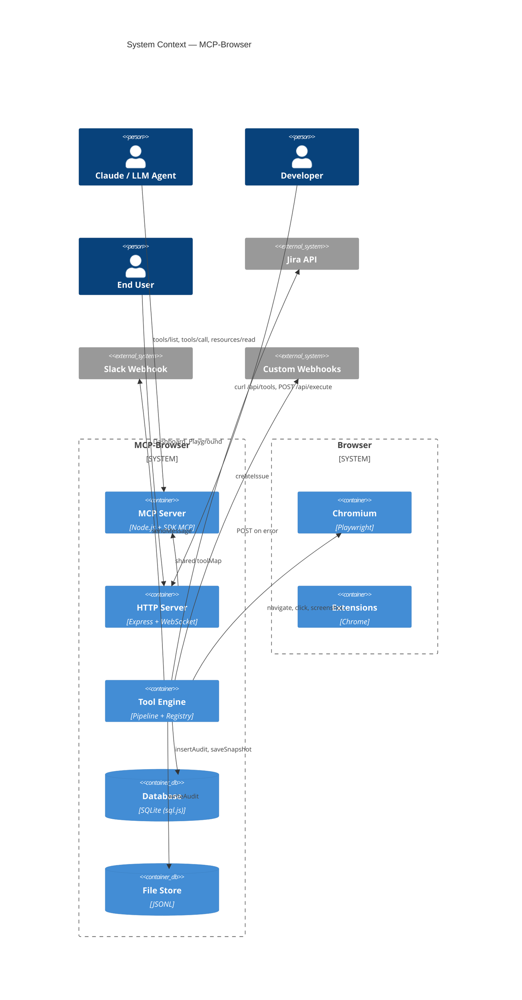

# Component Diagram (C4)

```mermaid
C4Context
  title System Context — MCP-Browser

  Person(claude, "Claude / LLM Agent")
  Person(dev, "Developer")
  Person(user, "End User")

  System_Boundary(mcpb, "MCP-Browser") {
    Container(mcp, "MCP Server", "Node.js + SDK MCP")
    Container(http, "HTTP Server", "Express + WebSocket")
    Container(engine, "Tool Engine", "Pipeline + Registry")
    ContainerDb(db, "Database", "SQLite (sql.js)")
    ContainerDb(fsdb, "File Store", "JSONL")
  }

  System_Boundary(browser, "Browser") {
    Container(cr, "Chromium", "Playwright")
    Container(ext, "Extensions", "Chrome")
  }

  System_Ext(jira, "Jira API")
  System_Ext(slack, "Slack Webhook")
  System_Ext(webhooks, "Custom Webhooks")

  Rel(claude, mcp, "tools/list, tools/call, resources/read")
  Rel(dev, http, "curl /api/tools, POST /api/execute")
  Rel(user, http, "Dashboard, Playground")
  Rel(http, mcp, "shared toolMap")
  Rel(engine, cr, "navigate, click, screenshot...")
  Rel(engine, db, "insertAudit, saveSnapshot")
  Rel(engine, fsdb, "writeAudit")
  Rel(engine, webhooks, "POST on error")
  Rel(engine, jira, "createIssue")
  Rel(engine, slack, "sendMessage")
```
