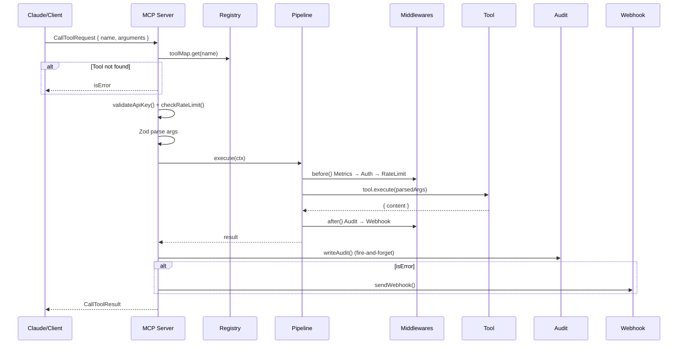

# Sequence Diagram — CallTool

```mermaid
sequenceDiagram
  participant C as Claude/Client
  participant S as MCP Server
  participant R as Registry
  participant P as Pipeline
  participant M as Middlewares
  participant T as Tool
  participant A as Audit
  participant W as Webhook

  C->>S: CallToolRequest { name, arguments }
  S->>R: toolMap.get(name)
  alt Tool not found
    S-->>C: isError
  end
  S->>S: validateApiKey() + checkRateLimit()
  S->>S: Zod parse args
  S->>P: execute(ctx)
  P->>M: before() Metrics → Auth → RateLimit
  P->>T: tool.execute(parsedArgs)
  T-->>P: { content }
  P->>M: after() Audit → Webhook
  P-->>S: result
  S->>A: writeAudit() (fire-and-forget)
  alt isError
    S->>W: sendWebhook()
  end
  S-->>C: CallToolResult
```
