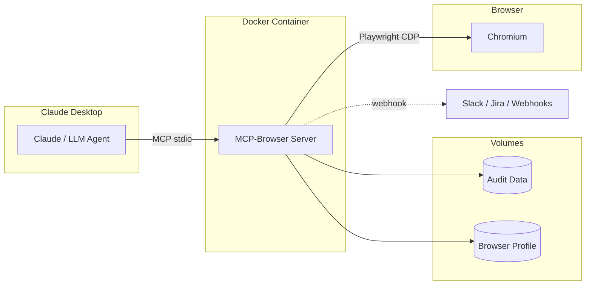

# Deployment Diagram

```mermaid
flowchart LR
  subgraph "Claude Desktop"
    CD[Claude / LLM Agent]
  end
  subgraph "Docker Container"
    MCP[MCP-Browser Server]
  end
  subgraph "Volumes"
    A[(Audit Data)]
    P[(Browser Profile)]
  end
  subgraph "Browser"
    CR[Chromium]
  end
  CD -->|MCP stdio| MCP
  MCP -->|Playwright CDP| CR
  MCP --> A
  MCP --> P
  MCP -.->|webhook| EXT[Slack / Jira / Webhooks]
```
