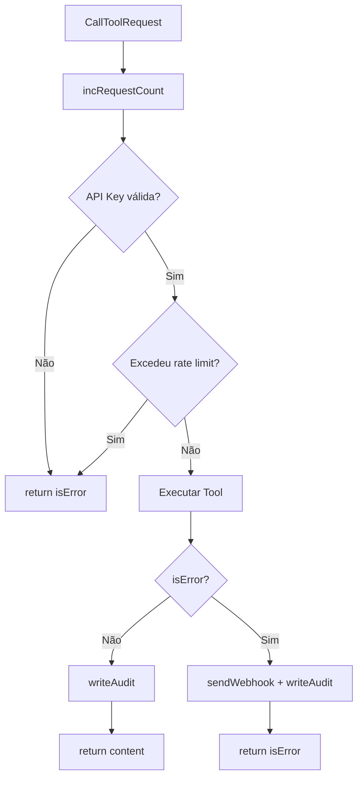

# Activity Diagram — Pipeline

```mermaid
flowchart TD
  A[CallToolRequest] --> B[incRequestCount]
  B --> C{API Key válida?}
  C -->|Não| D[return isError]
  C -->|Sim| E{Excedeu rate limit?}
  E -->|Sim| D
  E -->|Não| F[Executar Tool]
  F --> G{isError?}
  G -->|Não| H[writeAudit]
  G -->|Sim| I[sendWebhook + writeAudit]
  H --> J[return content]
  I --> K[return isError]
```
