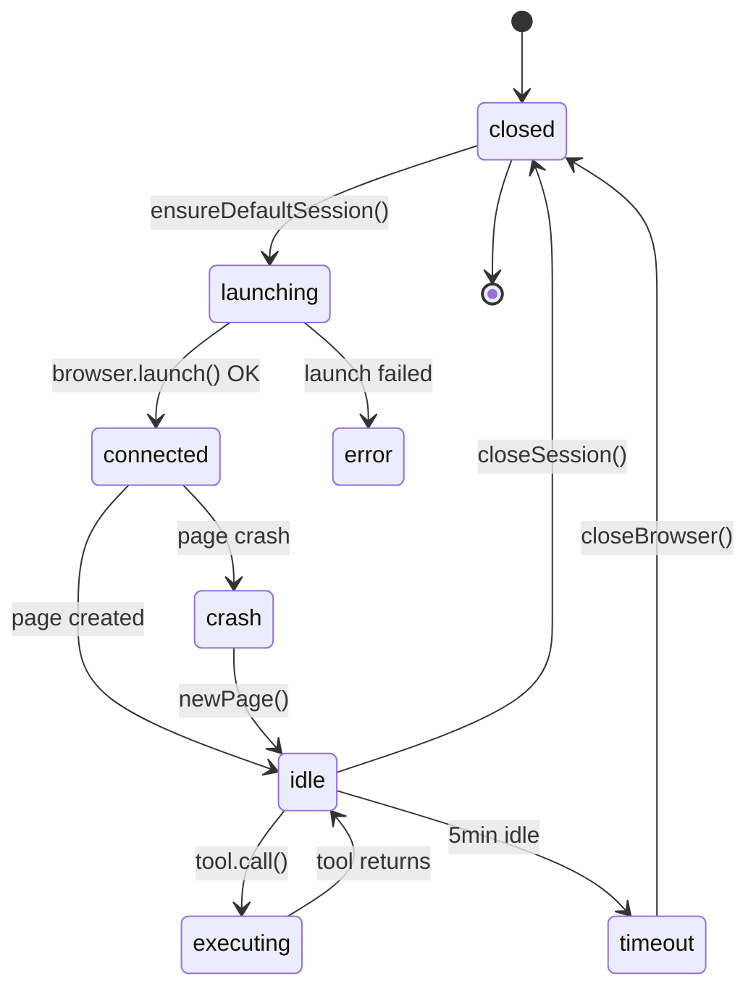

# State Diagram — Browser Session

```mermaid
stateDiagram-v2
  [*] --> closed
  closed --> launching: ensureDefaultSession()
  launching --> connected: browser.launch() OK
  launching --> error: launch failed
  connected --> idle: page created
  idle --> executing: tool.call()
  executing --> idle: tool returns
  idle --> timeout: 5min idle
  timeout --> closed: closeBrowser()
  connected --> crash: page crash
  crash --> idle: newPage()
  idle --> closed: closeSession()
  closed --> [*]
```
