# Postmortem Template

**Incident ID:** INC-{YYYY}-{NNN}
**Date:** {YYYY-MM-DD}
**Severity:** CRITICAL / HIGH / MEDIUM / LOW
**Duration:** {HH}h{MM}m
**Detected by:** {monitoring / user report / on-call}

## Summary

{One paragraph describing what happened, impact, and resolution}

## Impact

- **Users affected**: {number}
- **Tools affected**: {list of tools}
- **Features degraded**: {list}
- **Error rate peak**: {X%}
- **Latency increase**: {Xms to Xms}

## Timeline (UTC)

| Time | Event |
|------|-------|
| HH:MM | {First symptom detected} |
| HH:MM | {Alert fired} |
| HH:MM | {Engineer acknowledged} |
| HH:MM | {Root cause identified} |
| HH:MM | {Mitigation applied} |
| HH:MM | {Service restored} |
| HH:MM | {Monitoring confirmed recovery} |

## Root Cause

{Detailed explanation of the root cause, including:
- What happened technically
- Why it happened
- How it escaped detection}

## Contributing Factors

- {Factor 1}
- {Factor 2}

## Detection

- {How was it first detected — alert, user report, manual check?}
- {Would it have been caught faster with better monitoring?}

## Resolution

{Step-by-step of what was done to fix}

## Action Items

| Action | Type | Owner | Bug/Issue |
|--------|------|-------|-----------|
| {Action description} | prevent/detect/mitigate | @engineer | #ISSUE |
| {Action description} | prevent | @engineer | #ISSUE |

## Lessons Learned

### What went well
- {Thing 1}
- {Thing 2}

### What went wrong
- {Thing 1}
- {Thing 2}

### What will we do differently
- {Thing 1}
- {Thing 2}

## Blameless Statement

This postmortem is a blameless analysis of what happened and why. The goal is not to assign fault but to improve our systems and processes so this incident doesn't happen again.

## Timeline Diagram

```mermaid
gantt
  title Incident Timeline
  dateFormat HH:mm
  axisFormat %H:%M

  section Degradation
  Symptom detected      :crit, 14:30, 5m
  Alert fired           :14:35, 2m

  section Response
  Engineer acknowledged :14:37, 3m
  Root cause identified :14:45, 10m

  section Recovery
  Mitigation applied    :14:55, 5m
  Service restored      :15:00, 2m
  Monitoring confirmed  :15:05, 5m
```

## Appendix

- **Grafana dashboard snapshot**: {link}
- **Logs excerpt**: {link}
- **Related PRs**: {link}
